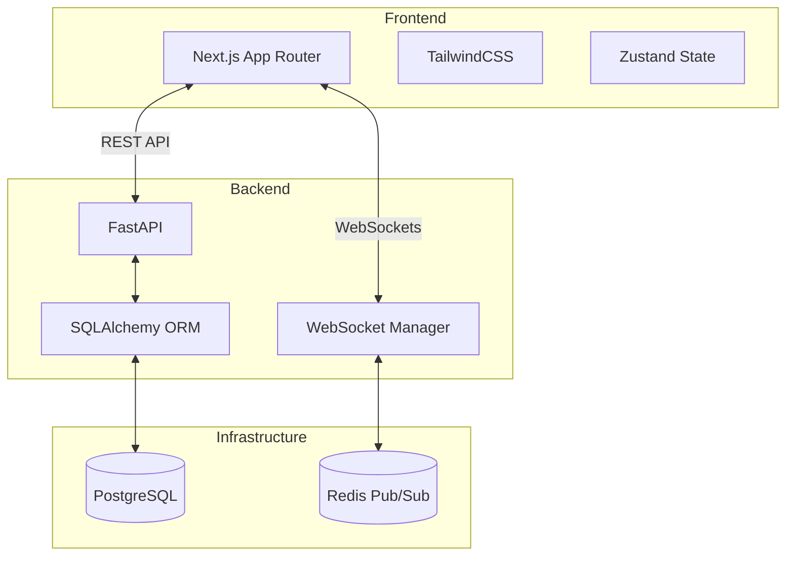

# QueueFlow 🚀

QueueFlow is a modern, real-time waitlist and queue management system designed for hospitals, clinics, and customer service centers. It provides complete transparency to patients/customers while giving powerful analytics and control to operators and administrators.

## Features ✨
- **Real-Time WebSockets:** Live token updates for patients—no refreshing required.
- **Role-Based Access Control:** Distinct dashboards for Customers, Operators, and Admins.
- **Historical Analytics:** Calculate accurate Wait Times and Service Times across all queues.
- **Live Operator Terminal:** Operators can Call Next Patient, Skip, Complete, or mark as Left.
- **Fully Dockerized:** Spin up the entire stack (Postgres, Redis, FastAPI, Next.js) with a single command.

## Architecture 🏗️



## Quick Start (Local Development) 💻

1. **Clone the repository:**
   ```bash
   git clone <repo-url>
   cd QueueFlow
   ```

2. **Set up Environment Variables:**
   Copy the example environment files:
   ```bash
   cp .env.example .env
   cp frontend/.env.local.example frontend/.env.local
   ```

3. **Run with Docker Compose:**
   ```bash
   docker compose up --build
   ```

4. **Access the Application:**
   - **Frontend UI:** `http://localhost:3000`
   - **Backend API Docs (Swagger):** `http://localhost:8000/docs`

5. **Seed the Database (Optional but Recommended):**
   To populate the system with Demo accounts and sample queues, run:
   ```bash
   docker compose exec backend python -m scripts.seed
   ```
   **Demo Accounts:**
   - Admin: `admin` / `password123`
   - Operator: `operator` / `password123`

## API Documentation 📚
The backend provides auto-generated OpenAPI (Swagger) documentation. Once the backend is running, navigate to:
👉 **[http://localhost:8000/docs](http://localhost:8000/docs)**

From there, you can view all available endpoints, required payloads, and even test API calls directly in the browser.

## Deployment to Railway 🚂
QueueFlow is designed to be easily deployed to Railway.app:
1. Provision a PostgreSQL database and a Redis database in your Railway project.
2. Deploy the `backend` folder as a service. Set the `DATABASE_URL` and `REDIS_URL` environment variables. Set `FRONTEND_URL` to your future frontend domain.
3. Deploy the `frontend` folder as a service. Set `NEXT_PUBLIC_API_URL` to your new backend URL.

## Tech Stack
- **Frontend:** Next.js 14 (App Router), React, TailwindCSS, Zustand
- **Backend:** Python 3.11, FastAPI, SQLAlchemy, Alembic, Passlib (Bcrypt)
- **Database:** PostgreSQL
- **WebSockets/PubSub:** Redis
